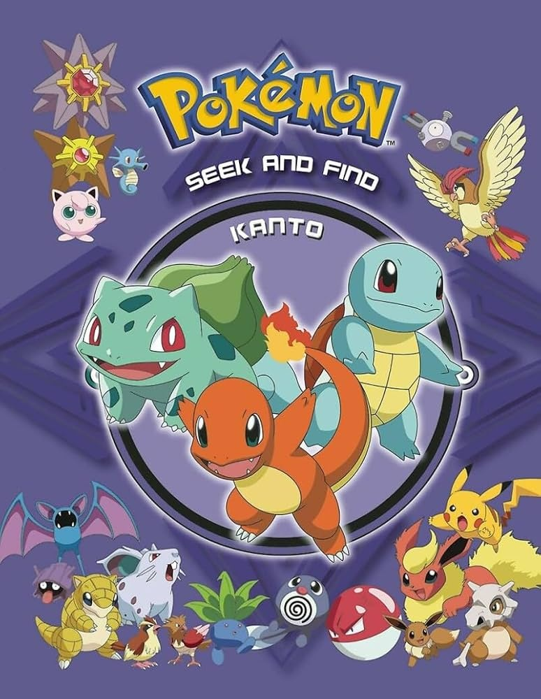
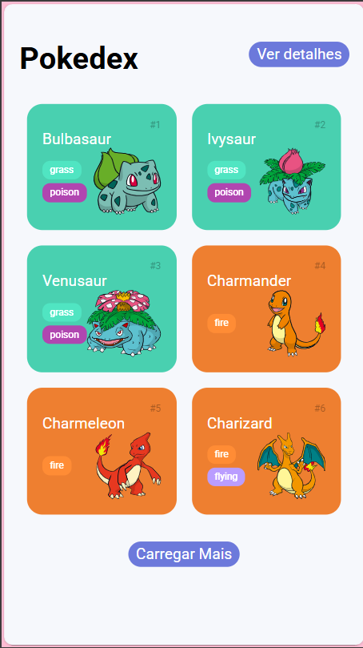
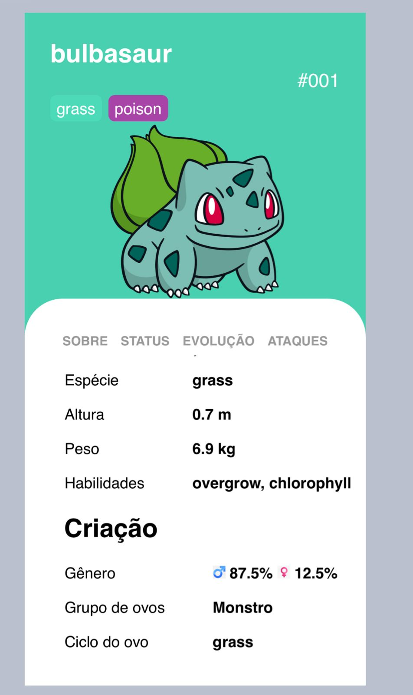
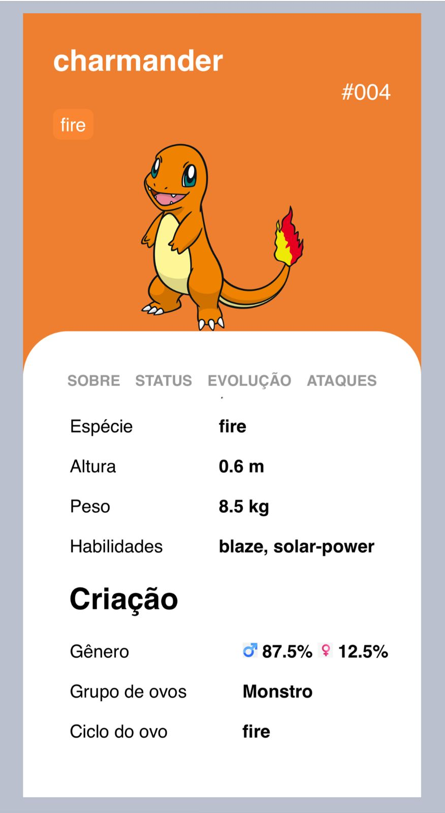
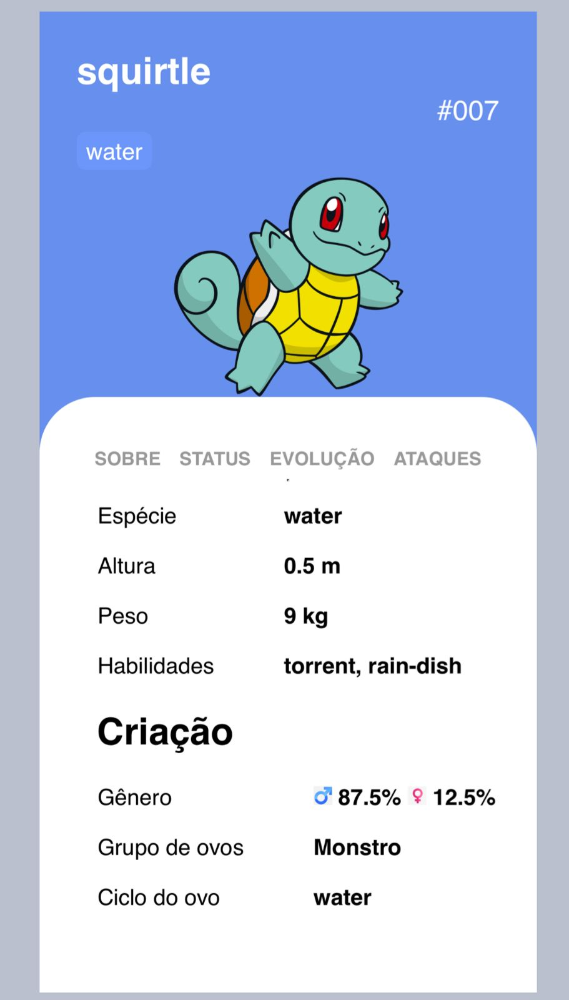
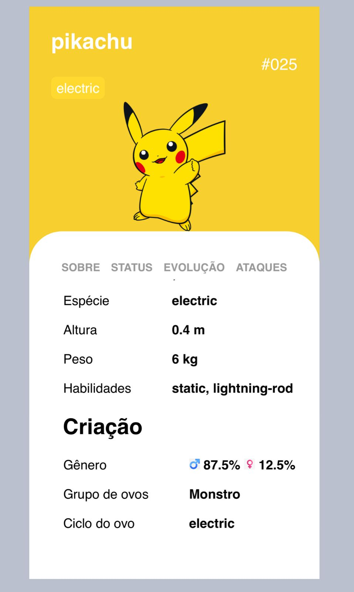

# Pokedex Project - Gen I

Este projeto é uma enciclopédia virtual de Pokémon que consome dados da **PokeAPI**. Ele foi desenvolvido com foco em uma interface moderna e fluida, utilizando conceitos de **Single Page Application (SPA)** para garantir uma navegação sem interrupções.

---

## Visão Geral do Projeto

Para ilustrar o tema de Pokedex, abaixo está uma imagem de capa com diversos Pokémon da primeira geração, a qual este projeto se dedica a listar.

<div align="center">
  
</div>

---

## Origem do Projeto e Desafio

Este projeto foi desenvolvido como um **desafio de projeto** prático dentro da **formação JavaScript Developer** oferecida pela **DIO (Digital Innovation One)**. O objetivo foi aplicar e consolidar os conhecimentos adquiridos sobre JavaScript assíncrono, manipulação do DOM e integração com APIs.

## Screenshots da Aplicação

<div align="center">
  
  <br>
  <em>Interface principal com listagem dinâmica e tema personalizado.</em>
</div>

<br>

### Temas Adaptativos por Tipo

| 🌿 Grama | 🔥 Fogo | 💧 Água | ⚡ Elétrico |
| :---: | :---: | :---: | :---: |
|  |  |  |  |
<div align="center">
  <br>
  <em>Exemplos da interface adaptativa baseada no elemento principal do Pokémon.</em>
</div>

---

## Funcionalidades

* **Listagem Dinâmica:** Cards estilizados com nome, número (#) e tipos.
* **Cores por Elemento:** O fundo dos cards e badges mudam dinamicamente conforme o tipo do Pokémon.
* **Navegação por Abas:** Detalhes como "Sobre", "Status", "Evolução" e "Ataques" carregados via JavaScript.
* **Escopo Limitado:** Focado exclusivamente nos **151 Pokémon originais** da Primeira Geração (Kanto).

### Melhorias de UI/UX
- **Botão de Detalhes Sticky**: Implementado posicionamento `sticky` para garantir que o botão de navegação acompanhe a rolagem da página, melhorando a acessibilidade em dispositivos móveis.
- **Layout Responsivo**: Ajustes no Box Model para alinhar o cabeçalho e o botão dinamicamente.

## Desafios Técnicos

Como estudante de **Engenharia de Software**, este projeto permitiu aplicar conceitos práticos de:

1.  **Manipulação de Assincronismo (Fetch API):** Gerenciar múltiplas requisições simultâneas à API para garantir que os dados e imagens fossem carregados na ordem correta, sem travar a interface do usuário.
2.  **Estilização Dinâmica e UX:** O maior desafio foi criar uma arquitetura CSS que permitisse a alteração de cores de forma dinâmica (baseada no tipo do Pokémon) mantendo o contraste e a legibilidade, além de garantir que a div de detalhes ocupasse exatamente os 40% inferiores da tela.
3.  **Lógica SPA:** Implementar a troca de conteúdo das abas de detalhes sem o recarregamento total da página, otimizando a performance e a experiência de uso.

## Pré-requisitos e Instalação

Para rodar este projeto localmente, você precisará do **Node.js** instalado em sua máquina.

1.  **Clone o repositório:**
    ```bash
    git clone [https://github.com/seu-usuario/pokedex-gen1.git](https://github.com/seu-usuario/pokedex-gen1.git)
    ```
2.  **Navegue até a pasta do projeto e instale um servidor estático (opcional):**
    ```bash
    npm install -g live-server
    ```
3.  **Inicie o projeto:**
    ```bash
    live-server
    ```

---

## 👩‍💻 Autora

**Milena Oliveira** Estudante de Engenharia de Software - 7º Período  
Analista Júnior na BR GAAP

[]((https://www.linkedin.com/in/milena-soares12/))

---
